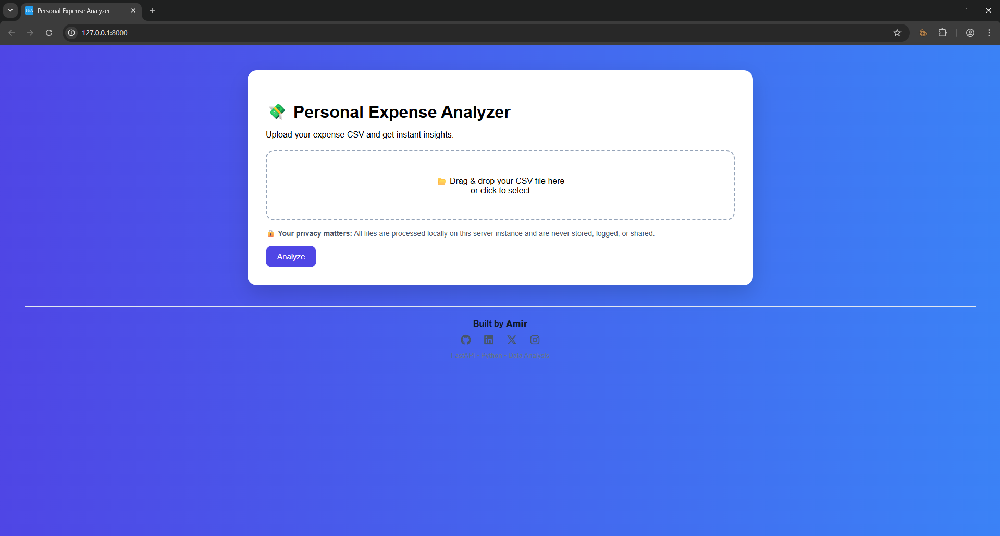
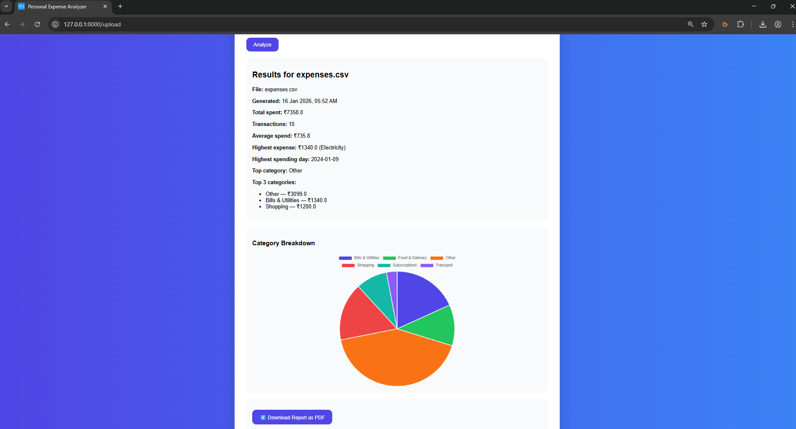
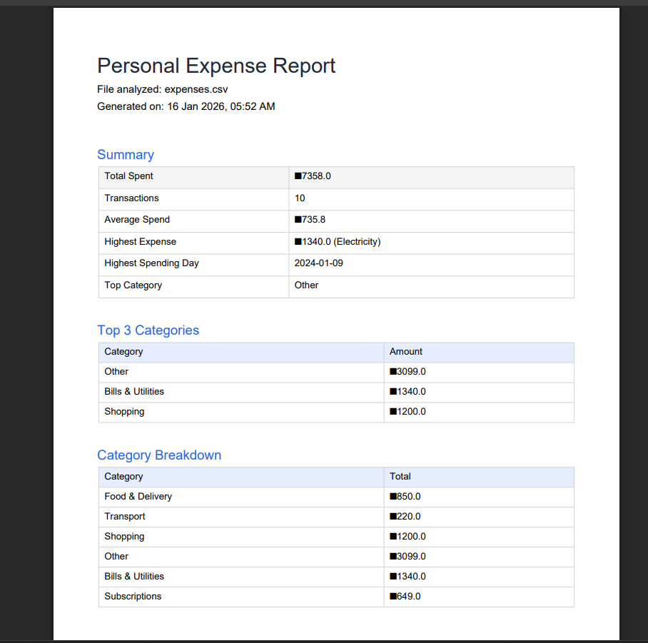

# Personal Expense Analyzer

Personal Expense Analyzer is a web-based application for analyzing financial statements.  
It supports CSV files and HDFC Bank PDF statements, extracts transactions, categorizes them using a rule-based engine, and generates meaningful insights through a dashboard and downloadable report.

This project demonstrates practical backend development, data processing, and product-oriented design using Python and FastAPI.

---

## Features

- Upload and analyze:
  - CSV expense files
  - HDFC Bank PDF statements
- Rule-based intelligent transaction categorization
- Analytics generated:
  - Total spending
  - Transaction count
  - Average spend
  - Highest expense
  - Highest spending day
  - Category breakdown
- Interactive pie chart visualization
- Downloadable PDF financial report
- Drag-and-drop file upload interface
- Input validation and error handling
- Privacy-focused design (no permanent data storage)

---

## Tech Stack

- Backend: FastAPI (Python)
- Frontend: HTML, CSS, JavaScript
- Templating: Jinja2
- Data Processing: Pandas
- Visualization: Chart.js
- PDF Parsing: pdfplumber
- PDF Report Generation: reportlab

---

## How to Run Locally

Clone the repository:

```bash
git clone https://github.com/amir-dev-flux/personal-expense-analyzer.git
cd personal-expense-analyzer
```

Install dependencies:

```bash
pip install -r requirements.txt
```

Run the application:

```bash
uvicorn app:app --reload
```

Open in your browser:

```cpp
http://127.0.0.1:8000
```

## CSV Input Format

CSV files must follow this structure:

```csv
date,description,amount
2025-01-01,Zomato Order,250
2025-01-02,Amazon Purchase,1200
2025-01-03,Netflix Subscription,499
```

## PDF Support

Currently supported: - HDFC Bank PDF statements

Planned improvements: - Support for additional banks - More robust generic PDF parsing - Improved categorization accuracy

## Privacy Notice

This application is designed with privacy in mind. Uploaded files are processed locally within the running instance. Files are not permanently stored. No user data is logged, tracked, or shared. Users are encouraged to use mock data for public demonstrations.

## Screenshots






## Roadmap

- Support for more bank statement formats
- Improved categorization rules
- Machine learning-based categorization (future version)
- Authentication and user accounts
- Cloud deployment

---

## Author

Amir  
GitHub: https://github.com/amir-dev-flux  
LinkedIn: https://www.linkedin.com/in/amir-dev-flux/  
X: https://x.com/amirflux  
Instagram: https://www.instagram.com/amir.dev.flux/

---

## License

This project is open-source and available under the MIT License.
